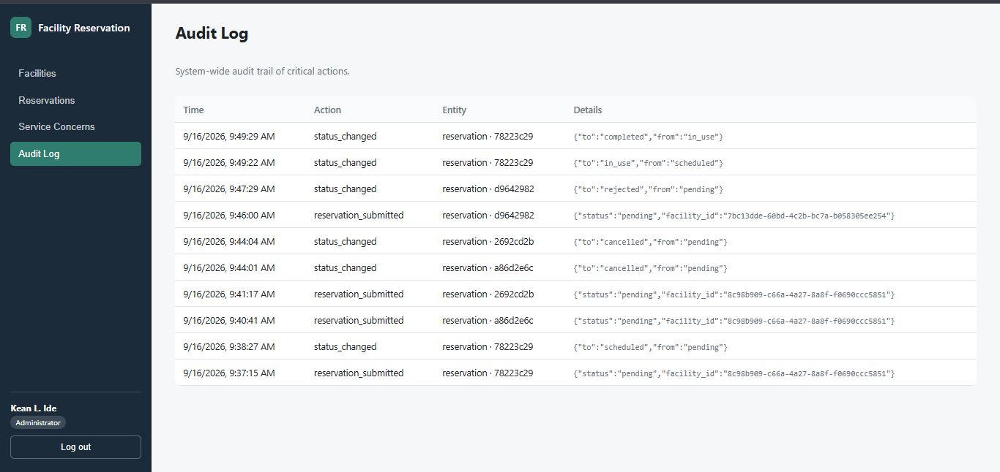

# Role-Based Facility Reservation and Approval System
Laboratory 4 - Section B | Systems Analysis and Design


## A: Sample Administrator: 
Email:kean@gmail.com
Pass:123456789
## B: Sample Requester: 
Email:ignacio@gmail.com
Pass:123456789
## C: Sample Facility Staff: 
Email:baslan@gmail.com
Pass:123456789

## 
| 1 | GitHub repository URL | `https://github.com/keancrusader21-hue/SAD-FacilityReservation-Ide` 

| 2 | Live GitHub Pages URL | `https://keancrusader21-hue.github.io/SAD-FacilityReservation-Ide/`


## 2. Role-Permission Matrix

| Role | Permitted Functions |
|---|---|
| Administrator | Manage facilities and users; approve/reject reservations; view service concerns, reports, and audit logs |
| Facility Staff | View reservations; confirm facility usage (mark In Use); record completion; create service requests; update facility condition |
| Requester | View facilities; submit reservation requests; view status; cancel own eligible (Pending) requests; view history |

## 3. Reservation Workflow

```
Reservation Submitted → Pending → Administrator Review → Approved / Rejected
If Approved → Scheduled → In Use → Completed
(Pending requests may also be Cancelled by their owner)
```
Statuses: `pending, approved, rejected, scheduled, in_use, completed, cancelled`

Note: in this implementation, "Approved" and "Scheduled" collapse into one step — the `enforce_reservation_rules()` trigger automatically moves a reservation from `approved` to `scheduled` the instant it's approved (BR-B4-06), since approval *is* what reserves the slot.

## 4. Business Rules (enforced server-side via Postgres triggers/RLS — not just in the UI)

| ID | Rule | Enforced by |
|---|---|---|
| BR-B4-01 | Only active facilities may be reserved | `enforce_reservation_rules()` trigger |
| BR-B4-02 | Reservation start must precede end time | table CHECK constraint + trigger |
| BR-B4-03 | Overlapping approved schedules are prohibited | `enforce_reservation_rules()` overlap query |
| BR-B4-04 | Only Administrator may approve reservations | RLS policy + UI role check |
| BR-B4-05 | Rejected reservations cannot become Scheduled | `enforce_reservation_rules()` trigger |
| BR-B4-06 | Approved reservations reserve the time slot | trigger auto-transitions to `scheduled` |
| BR-B4-07 | Completed reservations cannot be edited | `enforce_reservation_rules()` trigger |
| BR-B4-08 | Facilities under Maintenance cannot be reserved | `enforce_reservation_rules()` trigger |
| BR-B4-09 | Requesters may modify only their own Pending requests | RLS UPDATE/DELETE policy |
| BR-B4-10 | Approval and status changes must be logged | `log_reservation_change()` / `log_facility_change()` triggers |

## 5. ERD (entities and relationships)

```
profiles (1) ───< reservations (many)      [profiles.id = reservations.requester_id]
profiles (1) ───< reservations (many)      [profiles.id = reservations.reviewed_by]
profiles (1) ───< service_requests (many)  [profiles.id = service_requests.staff_id]
facilities (1) ───< reservations (many)    [facilities.id = reservations.facility_id]
facilities (1) ───< service_requests (many)[facilities.id = service_requests.facility_id]
profiles (1) ───< audit_logs (many)        [profiles.id = audit_logs.actor_id]
```
Key attributes:
- **profiles**: id (PK, = auth.users.id), full_name, role {admin, staff, requester}
- **facilities**: id (PK), name, description, location, capacity, status {active, maintenance, inactive}
- **reservations**: id (PK), facility_id (FK), requester_id (FK), purpose, start_time, end_time, status, reviewed_by (FK)
- **service_requests**: id (PK), facility_id (FK), staff_id (FK), description, status
- **audit_logs**: id (PK), actor_id (FK), action, entity_type, entity_id, details (jsonb), created_at

## 6. Use Case Diagram (actors and use cases)

```
Administrator:
  - Manage Facilities (Add/Update/Delete)
  - Approve/Reject Reservation
  - View Audit Log
  - View Service Concerns

Facility Staff:
  - View Reservations
  - Mark Facility In Use / Completed
  - Log Service Request
  - Update Facility Condition (status)

Requester:
  - View Facilities
  - Submit Reservation Request
  - View Reservation Status/History
  - Cancel Own Pending Request
```

## 7. Manual Test Script (TC-B4-01 to TC-B4-10)

| Test ID | Steps | Expected | Result |
|---|---|---|---|
| TC-B4-01 | Log in as Requester → Facilities → Reserve an active facility → submit | Row appears in Reservations with status **Pending** | ☐ Pass / ☐ Fail |
| TC-B4-02 | Submit a reservation for a facility/time that overlaps an already-Approved one | Insert/approve blocked with a schedule-conflict error | ☐ Pass / ☐ Fail |
| TC-B4-03 | Log in as Administrator → Reservations → Approve a Pending request | Status becomes **Scheduled** | ☐ Pass / ☐ Fail |
| TC-B4-04 | As Administrator, Reject a Pending request | Status becomes **Rejected** | ☐ Pass / ☐ Fail |
| TC-B4-05 | Log in as Facility Staff → mark a Scheduled reservation "In Use" | Status updates to **In Use** | ☐ Pass / ☐ Fail |
| TC-B4-06 | As Facility Staff, mark an In Use reservation "Complete" | Status becomes **Completed** | ☐ Pass / ☐ Fail |
| TC-B4-07 | As Requester A, try to edit/cancel Requester B's request (e.g. via API) | Blocked by RLS policy | ☐ Pass / ☐ Fail |
| TC-B4-08 | Set a facility's status to Maintenance → try to reserve it | Blocked with an error from the trigger | ☐ Pass / ☐ Fail |
| TC-B4-09 | As Administrator, open Audit Log | Approval/status-change entries are visible | ☐ Pass / ☐ Fail |
| TC-B4-10 | Log out → open `dashboard.html` directly | Redirected to `index.html` (access denied) | ☐ Pass / ☐ Fail |

*Check off Pass or Fail per row while you run through the script on the live deployment, right before submission — a dated screenshot of this filled-in table (or the actual dashboard views) is stronger evidence than the table text alone.*

## 8. Submission Package
   
